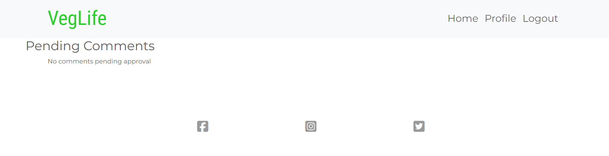
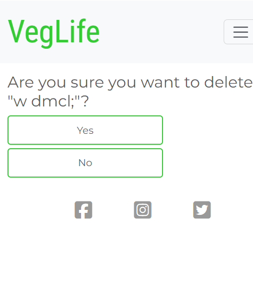
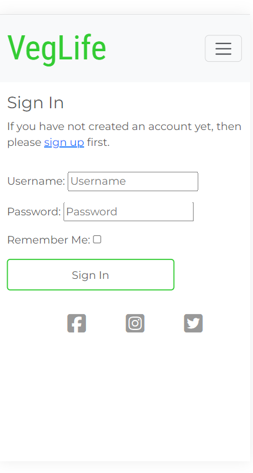
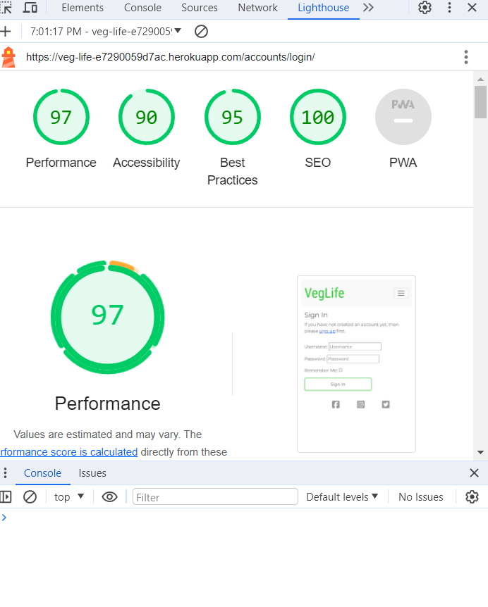

# VegLife

VegLife is a blog post website aimed at vegans. It's purpose is centred around various vegan topics such as lifestyle, food, fashion, and all things that may be interetsing to vegans. The goal of the project was to create a space that is interactive for the user so that they can better interact with their community.

# Design

In this section I will cover the overall design choices of this project.

## Design goals

The overall goal with the design of this project is to make it instantly recognisable what this project is about, create a space that is easy to understand and navigate where users can interact with the content posted as well as customise their own profiles.

## Tools

This project was made using Django, Python, HTML5, CSS3, Bootstrap, and a minimal amount of JavaScript.

Other technologies that I have used are Cloudinary API for storing images on the cloud, allauth for logins and creating secure user registraion, Summernote for forms used to create posts as they have options such as bold and other font modification, and Crispy forms to do some of the more basic forms such as the comment sections ones. I had also used coverage for testing purposes.

## Layout

This project has aimed to have a clear layout on both desktop and mobile, as well as medium sized screens. From the home page I wanted their to be an easy to understand nav bar at the top as well as a photo that makes it easy to understand the subject matter. It will then then go down into a search bar area for users to search by topic and have a page where up to 6 posts will be displayed. There will also be a create post and approve comment buttons, if you are logged in as a super user.

Depending on if the user is logged in or not this will change what the content of the nav bar are, if logged in they will have home, profile, and logout, where logged out users will have home, login, register. This style will also change to a burger icon on smaller screens.

Posts will be layed out in 2 columns showing the author, an image, title, excert, as well as the amount of likes. On samller screens, this will shrink down to 1 column. Wehn posts are clicked the display iamge will be on the top right hand side along with the title going down into the post where the details will be displayed. Under this you will have like button, comment counter, bookmark button, as well as edit and delete if you are the author.

Below is the comment section, which will display the comments on the left and have a block on the right for users to comment. The user will be able to click on the author or commentors name to be taken to their profile. On smaller screens the display will shift to have the comments on top of the comment box.

In the profile section you will see a round image containing a profile image, or a stovk image of a user if they have not set one up. Their is also various sections such as how long they have been vegan, bio, and favourite animal. If it is the logged in users profile, there will be an edit profile, bookmarks, and delete button. All delete buttons have a confirmation page.

I had decided to keep logo and nav bar at the top of each page and the footer at the bottom as I felt that this design choice is one that is very easy to understand for the user who is new to the website. The footer is links to social media platforms.

## Colour Scheme

The colour scheme that I have used for this project is #33cc33 a soft shade of green that I felt was very fitting for vegans as green is a commonly associated colour with vegetables, #595959 a grey colour which I opted for as I thought the black would look too harsh, but it also a dark enough grey to be clearly visible against the white background. I have also used some red in the home image as I felt this coloyr draws attention. Overall I feel this colour scheme is very readable and goes with the general aesthetic that vegans generally like.

# Features

In this section I will be covering the various features I have implemented, who I had in mind when creating them, and why they are useful. This project will be using the view / model / template functionality and have a high number of different html docs and python scripts.

These features will include a responsive design where the layout changes depending on screen size, like, comment, and bookmark functionality. A custom model that allows users to create their own profile. Ability to create posts for suoer users. And a pagination system that allows multiple pages to be made for every 6 posts.

There will also be feedback to the user whenever they do something in the form of toats messages. When they create, delete, edit anything such as their profile or a post, they will be given feedback for this.

# User Stories

- User Story 1: Setup Django
- As a Developer, I want to set up Django and install the libraries that I need to get the environment setup properly

- User Story 2: Early Deployment
- As a Developer, I want to deploy do an early deployment of the app to Heroku so that I can make sure that everything is working and that I can do continuous testing during the project

- User Story 3: Django Setup and Secret keys
- As the Developer, I want to setup my Django workspace and and hide my secret keys so that I do not expose secret files,

- User Story 4: Create HTML docs
- As a Developer, I want to get my html templates set up so I can use them throughput the development of the project

- User Story 5: Creating an account as a user
* As a User, I would like to be able to create an account, so that I can view posts and interact with the website.

- User Story 6: View own profile
- As a User, I would like to be able to view my own profile and also see what other users can see when they view my profile

- User Story 7: Insatll Bootstrap
- As a user, I want to set up my environment to include bootstrap so I can apply styling to various parts of the project.

- User Story 8: Login / Logout functionality
- As a User, I would like to be able to login or logout of my account

- User Story 9: View Posts
- As a user, I can view the posts on the website

- User Story 10: Create Posts
- As an admin user, I would like to be able to create posts for the community to review

- User Story 11: Commenting and Liking
- As a user, I want to be able to comment and like various posts and other peoples comments

- User Story 12: User can customise their own profile
- As a User, I would like to be able to edit my profile details such as my bio, so that I can make sure that I am showing relevant, up-to-date information

- User Story 13: Update Posts
- As an admin user, I can update a post that I have created, so that I can correct any mistakes I may have made or add new information

- User Story 14: Delete Posts
- As an admin user, I can delete a post that I made and remove it from the site entirely

- User Story 15: User has option to delete their account
- As a user, I can delete my account, so that I can remove my details and comments from the site

- User Story 16: Bookmarking posts
- As a User, I would like to be able to bookmark interesting posts, so that I can come back and view them again

- User Story 17: Post searching
- As a User, I would like to be able to search the post, so that I can find ones that match the topic I'm looking to explore

- User Story 18: Clear Post layout
- As a User, I would like clear layout of the posts I have clicked, so I can clearly see the information being presented

- User Story 19: Responsiveness
- As the owner of the site, I would like my site to be fully responsive, so that users accessing the site from different devices have an enjoyable experience

# Wireframes

Please see attached wireframes for the main pages of the project, being the home page, a post detail page, and the profiles page. These are the 3 main sections of the project and I will show the home page a post detail page wireframes from lareg and small screens, and the profile page is very similar no mater screen size so only has a asingle wireframe.

# Navigation Bar

- The navigation bar and logo

* Featured on every page and part of the base.html.
* This was created to help the user flow of the website and allow the user to jump between each section at will without having to rely on back commands from the browser. The logo also acts as a home button if the user would like to use that.
* When on a page, the nav bar will have an underline to show the user which specific page they are on. When hovering over a new page the colour will also change to the green to contrast.
* DEpending on if user is logged in or out, the options will differ. Both having home as an option but login and sigup as option if your logged out, and profile and logout if you're logged in

# Hero Image and text

- Hero image and text

* The hero image was designed to make the introduction the website instantly recognisable.
* The image is fresh looking tomatoes paired with some green veg.
* the image has an overlay of some text to further show the user what the subject of the site is.

# Welcome, Search bar, and Post Creation / Comment Approval

- VegLife introduction

* This is an introductory piece of info with a simple welcome message
* Underneath is a clear search bar with a magnify search button next to it so the user can search specific topics
* Below this is 2 buttons which are only visible for super users, these are buttons for creating new posts and apporving user comments.

# Posts Section

- The Posts Section

* This section has two columns running down either side of the page, each column contains up to 3 posts.
* In these you will see a featured image, a title, the author, an excerpt, as well as the number of likes and the time and date of posting.
* The posts display in a chronological order and when clicked will bring you to the content of the posts
* This wil display as a single column on smaller screens
* If there are more than 6 posts, there will be a next button a the end of the screen to take the user to the next selection of posts.

# Footer

- Footer section

* The footer section will be appearing on all the pages. This has been designed with a minimal approach, using links that will take you to social media pages. I have not created social media pages for each of these so the link will guide to the home page of each website.

# Post Details

- The contents of each post

* When going into a post you will see the image on the right and the title on the left
* On mobile the image will not appear
* Beneath you will see the content of the post
* Lastly is the buttons and like / comment counter. you will see 3 buttons usually unless you created the post, then there is 5
* Like, comment counter, bookmark button, edit, and delete
* These display horizontal on desktop and vertical on mobile

# Comment Section

- Comment section displayed on every post

* The comment section displays comments on the left and space for user to comment on the right.
* Comments will have a link to the user who posted thems profile, a like button, and time and date of posting
* When liked, the colour will change and the counter will increase.
* If it is a comment you have posted, there will also be a delete button
* This is the only delete button that will not ask for confirmation, my reason for this is comments are much shorter and easier to mskr another one, so did not want to add another confirmation page
* When a user comments it must be approved by a super user, this is to stop spam or inappropriate messages as vegan website are often targets of hate.

# Create Post form

- Form for post creation

- A simple form using summernote for the content.
- This has a title, content, image, and excerpt section
- summernote was used here so the poster can make text bold as well as other stylings

# Approve Comments Page

- Page for approving comments

- This is the page where super users can approve all other users comments.
- There will be an option next to the comment section and if they are accepted you will be taken to the page of the post to show the comment is now there.
- If you decide to delete the post you are also taken back to the original post, but the comment will not appear and will be wiped from the system.
- If there are no comments, the user will be told this.

# Edit post

- Form for editing posts

- This section is pretty much identical to post creation.
- It includes everything the same and when saved the post will be updated, and the user will be given feedback

# Delete Post

- This section is what a user will see wwhen deleting a post.
- They will be given a confirmation screen, if they select yes the post will be removed, they will be directed to the home screen, and given feedback
- If they do not accept, they will be directed back to the unchanged post

# Profile

- The profile section can be accessed through the navbar for logged in users.
- It will have your profile picture (or a default image) in a circle on the top left, followed by your username
- Below this will be your basic info, or which ever users page your ons basic info
- This is info such as how long your vegan, a bio, interested, and favourite animal.
- If this is your page you will also see an edit, bookmark, and delete button.

# Edit profile

- The edit profile section is where users can change their information
- It is a basic form that allows users to upload a photo for their progile photo, update bio, include interests, and enter their favourite animal
- They will also have a selection of vegan length, which is drop down menu for them to select from
- Including this information is entirely option

# Bookmarks

- This the section where a user will be able to see every post they have bookmarked.
- By clicking any of these, they will be taken to that specific post.
- If the user has not bookmarked any post a paragraph will appear saying no bookmarked posts yet

# Delete profile

- This section will appear after the user has selected to delete their profile.
- It will have 2 buttons, yes and no.
- The yes button will delete the profile and bring you back to the home page as a logged out user and give feedback with a toast message.
- The No button will take you back to your profile.

# Login Page

- This is the allauth page for logging in as a user who has already registered
- I have altered it slightly to remove the forgot password link, as this is a feature I will not be using in this project.

# Logout Page

- This is the allauth page for logging out
- It is simple and only has one button for confirmtaion.

# Registeration Page

- The registration page is provided by allauth as well
- It has a section to enter your username, password, confirmation, and has instructions and what kinds of passwords are allowed.
- There is also an optional section for email

# 404 Error page

- A simple 404 page telling the user that this page does not exist.
- Includes a link back to the hom page.

# Future Features

- There were a number of features that I would have liked to implement, but felt they were outside the scope of this project or unneccessary
- One of these features was giving the user the option to change their password. I had begun implementing this but stopped as I had to make linking emails to profile mandatory and felt this was outside the scope of this project.
- Another feature I wanted to implement was a dark mode, but has opted against it as I felt it may be too time consuming and not needed for this particular project.
- I would like to come back at a future date, and implement them in future.

# Testing

- Ran html through W3C validator, have gotten some small warning back. One of the pages is the Signup / Registration pages which is an allauth page that I am unable to edit. Another is any page using summernote, again which I am unable to edit.

- Ran through Jigsaw css checker, no issues.

- Ran through Pep8 checker for Python and come back with mostly no errors. One line could not be shortened and this was line 72 in test_models.py

- I have checked screen compatibility for phone and tablet, I have checked tablet by using the inspect tool and shrinking down to size and have tested on my own personal mobile to assure it is responsive.

# Bugs

Throughout the project I had encountered several bugs which I will give details of in this section.

Resolved bugs:

- An issue I encoutered was when starting out the project and setting up the registration page using allauth. The page was giving me an error when ever I correctly completed the form. This was a redirection but I noticed it was not happening on a different browser. I realised the issue was with the browser settings I had configured but once had moved browser it was working perfectly.
- Another issue I encountered was extending the base.html to my allauth pages, eg. login/logout etc. After changing it to extend the correct html it was still not showing visually. I had noticed I had accidentally has the allauth files in my directory twice and the one I was working for was the incorrect one. after extending the base in the correct file and eleteing the duplicate it worked as expected.
- Another issue I faced was in creating posts from the frontend. When I was creating them I kept getting a no reverse match error. Upon investigating I found out that a slug was noy being created automatically. To fix this I overided the save method in the models which had them working perfectly
- An issue I encountered was when making other users profiles viewable. Initially I could not figure out how to do this and was getting a no reverse error on any page that had a link to a user profile on it. This was because I was not properliny linking the profiles in but to the comments or author but when linked correctly it worked perfectly. This was initially on a seperate html sheet, but I condensed it to the same one as viewing your own profile just made an if statement to show extra buttons if its yours.
- Anpther issue I was having with deleting user comments automatically when a user deletes their profile. Initially, they were not deleting, but when I did some investigating I realised that the comments were not being correctly linked to profiles due to a typo. Once this was fixed, it worked perfectly.
- Another issue I was having was images loading incorrectly after deployment. I realised this was due to them following the file path instead of being taken from cloudinary. Once this was fixed it worked perfectly.
- Another issue was with how the posts were presenting. When going to smaller screens all the buttons for likes, bookmark etc where getting very distorted. After I removed a div they were much easier to change to a vertical presentation which looked far neater.

Unresolved bugs:

- As far as I am aware there are no unresolved bugs in the project.

# Lighthouse Testing

# Automated Testing

# Full Manual Testing

The following devices were used during testing:

Desktop:

- Acer Aspire 5 17" screen

Tablet:

- iPad Air
- iPad Mini

Mobile Devices:

- iPhone 12
- iPhone 12 Pro
- Samsung Galaxy S8+

The following browsers were used during testing:

- Google Chrome
- Safari

All features that are on multiple pages (eg. Logo, Nav bar, Social media links) will only show up as tested in the first page they appear on, but have been tested on all pages.

## Home page testing

<table>
    <tr>
        <th>Feature</th>
        <th>Expected Outcome</th>
        <th>Test</th>
        <th>Result</th>
        <th>Pass/Fail</th>
    </tr>
    <tr>
        <td>Logo</td>
        <td>When clicking logo takes back to home page</td>
        <td>Click logo</td>
        <td>Takes back to home page</td>
        <td>pass</td>
    </tr>
    <tr>
        <td>Nav bar highlight</td>
        <td>Hovered page on nav bar will change colour</td>
        <td>Hover over nav bar</td>
        <td>Changed colour</td>
        <td>pass</td>
    </tr>
    <tr>
        <td>Hero image animation</td>
        <td>Hero image will have a zoom effect on all screen sizes</td>
        <td>Reloaded page on different screen sizes</td>
        <td>Animation occured</td>
        <td>pass</td>
    </tr>
    <tr>
        <td>Social media links</td>
        <td>All social media links on footer take you to new tab of the indicated social media</td>
        <td>Click each link</td>
        <td>Social media opened in seperate tabs</td>
        <td>pass</td>
    </tr>
</table>

## Tricks Page Testing

<table>
    <tr>
        <th>Feature</th>
        <th>Expected Outcome</th>
        <th>Test</th>
        <th>Result</th>
        <th>Pass/Fail</th>
    </tr>
    <tr>
        <td>Auto play</td>
        <td>Videos do not autoplay when page is loaded</td>
        <td>Reload page and check videos</td>
        <td>Does not autoplay</td>
        <td>pass</td>
    </tr>
    <tr>
        <td>Volume tab</td>
        <td>Videos will allow user to control volume once clicked</td>
        <td>Start video and mute volume with a click or control with cursor</td>
        <td>Volume mutes or goes up/down as intended</td>
        <td>pass</td>
    </tr>
    <tr>
        <td>Pause button</td>
        <td>Video will be able to be paused at anytime</td>
        <td>Click center of video and button in bottom left corner</td>
        <td>Video paused</td>
        <td>pass</td>
    </tr>
    <tr>
        <td>Full screen</td>
        <td>Videos will allow you to go full screen</td>
        <td>Click full screen icon in bottom right corner</td>
        <td>Video appeared full screen</td>
        <td>pass</td>
    </tr>
</table>

## FAQ Page

<table>
    <tr>
        <th>Feature</th>
        <th>Expected Outcome</th>
        <th>Test</th>
        <th>Result</th>
        <th>Pass/Fail</th>
    </tr>
    <tr>
        <td>Link to contact page</td>
        <td>When click on the our Contact Page link will take you to contact form in same tab</td>
        <td>Click on our Contact Page link</td>
        <td>Opens contact page in same link</td>
        <td>pass</td>
    </tr>
    <tr>
        <td>Links to recommended products</td>
        <td>When clicking on any of the recommended products linked will take you to a new tab with products</td>
        <td>Click on all 4 of the different links</td>
        <td>Opens all links in new page with the correct product displayed</td>
        <td>pass</td>
    </tr>
</table>

## Contact Page

<table>
    <tr>
        <th>Feature</th>
        <th>Expected Outcome</th>
        <th>Test</th>
        <th>Result</th>
        <th>Pass/Fail</th>
    </tr>
    <tr>
        <td>Form must be complete before submitting</td>
        <td>Form does not allow you to proceed unless every section complete</td>
        <td>Click submit with some area not complete</td>
        <td>Does not allow you to continue</td>
        <td>pass</td>
    </tr>
    <tr>
        <td>Email tab</td>
        <td>Email section will not proceed unless an email address is entered</td>
        <td>Click on submit with my full name in the email tab</td>
        <td>Email tab asks me to put in an email address before proceeding</td>
        <td>pass</td>
    </tr>
    <tr>
        <td>Radio button</td>
        <td>Only one radio button option can be selected at a time</td>
        <td>Click one radio button and then click each one after, tried this with every combonation of button</td>
        <td>Does not allow me to have more than one clicked</td>
        <td>pass</td>
    </tr>
    <tr>
        <td>Submit colour change</td>
        <td>Submit button changed colour when hovered over</td>
        <td>Hover over submit button</td>
        <td>Colour of button changes</td>
        <td>pass</td>
    </tr>
    <tr>
        <td>Submit button cursor</td>
        <td>Submit button changes cursor when hovered over</td>
        <td>Hover over submit button</td>
        <td>Cursor changes</td>
        <td>pass</td>
    </tr>
</table>

## Thank You Page

<table>
    <tr>
        <th>Feature</th>
        <th>Expected Outcome</th>
        <th>Test</th>
        <th>Result</th>
        <th>Pass/Fail</th>
    </tr>
    <tr>
        <td>Redirect to home page</td>
        <td>When left on page for 10 seconds, you will be redirected to home page</td>
        <td>Load page and wait 10 seconds</td>
        <td>Redirected to home page</td>
        <td>pass</td>
    </tr>
</table>

## 404 Error Page

<table>
    <tr>
        <th>Feature</th>
        <th>Expected Outcome</th>
        <th>Test</th>
        <th>Result</th>
        <th>Pass/Fail</th>
    </tr>
    <tr>
        <td>Redirect to home page</td>
        <td>When left on page for 5 seconds, you will be redirected to home page</td>
        <td>Load page and wait 5 seconds</td>
        <td>Redirected to home page</td>
        <td>pass</td>
    </tr>
</table>

## Deployment

To deploy this project, I used Heroku, a cloud platform that allows you to easily host web applications. Follow these steps to access the deployed version:

* Visit the deployed application: https://veg-life-e7290059d7ac.herokuapp.com/
* You can explore the live version of the project to see it in action.

# Forking and Cloning

## Forking the Repository

To contribute to this project or create your own version, you can fork this GitHub repository. Forking creates a copy of the repository under your GitHub account. Follow these steps to fork the repository:

* Click the "Fork" button at the top right corner of this repository's page.
* This will create a copy of the repository under your own GitHub account.

## Cloning the Repository

To work with the code locally on your machine, you can clone the repository. Here's how:

* Open your terminal or command prompt.
* Navigate to the directory where you want to store the project.
* Run the following command to clone the repository:

git clone https://github.com/Sean-OBrien95/Veg-Life.git

# Credit

## Packages

asgiref                3.7.2 - https://pypi.org/project/asgiref/
cloudinary             1.36.0 - https://pypi.org/project/cloudinary/
coverage               7.4.1 - https://pypi.org/project/coverage/
dj-database-url        0.5.0 - https://pypi.org/project/dj-database-url/
dj3-cloudinary-storage 0.0.6 - https://pypi.org/project/dj3-cloudinary-storage/
Django                 3.2.23 - https://docs.djangoproject.com/en/5.0/topics/install/
django-allauth         0.58.2 - https://pypi.org/project/django-allauth/
django-crispy-forms    1.14.0 - https://pypi.org/project/django-crispy-forms/
django-summernote      0.8.20.0 - https://pypi.org/project/django-summernote/
gunicorn               21.2.0 - https://pypi.org/project/gunicorn/
oauthlib               3.2.2 - https://pypi.org/project/oauthlib/
pillow                 10.2.0 - https://pypi.org/project/pillow/
psycopg2               2.9.9 - https://pypi.org/project/psycopg2/
PyJWT                  2.8.0 - https://pypi.org/project/PyJWT/
python3-openid         3.2.0 - https://pypi.org/project/python3-openid/
pytz                   2023.3.post1 - https://pypi.org/project/pytz/
requests-oauthlib      1.3.1 - https://pypi.org/project/requests-oauthlib/
sqlparse               0.4.4 - https://pypi.org/project/sqlparse/ 

Bootstrap              5.3.2 - https://getbootstrap.com/docs/5.3/getting-started/introduction/

## Images

- VegLife logo image: https://www.istockphoto.com/vector/abstract-green-leaf-logo-icon-vector-design-ecology-icon-set-eco-icon-gm1045368942-279747493
- Veg stock photohome page: Photo by Rauf Allahverdiyev: <https://www.pexels.com/photo/tomatoes-1367242/>
- Default veg photo credit: wfmynews2 <http://content.kens5.com/photo/2017/10/22/vegetables_1508727313637_11456014_ver1.0.jpg>
- Default profile pic from researchgate: <https://www.researchgate.net/post/Why_is_RNA_contamination_effecting_my_PCR_product_size>
- Images used for profile pictures and posts may have been taken from google images, but are not hard coded into the project.

### I had learned some commands from the following websites

- Learned allauth configuration here: https://docs.allauth.org/en/latest/account/configuration.html
- How to add background image as a static image: https://stackoverflow.com/questions/39769469/the-way-to-use-background-image-in-css-files-with-django
- Various Bootsrap commands: https://www.w3schools.com/bootstrap/
